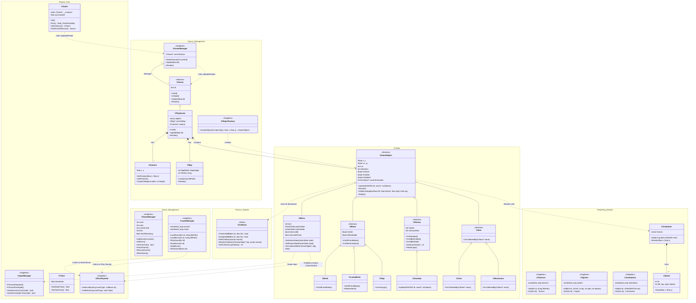

# Mario Game Engine Architecture

```mermaid
classDiagram
    %% --- GROUP 1: ENGINE CORE & SYSTEM ---
    namespace Engine_Core {
        class CGame {
            -static CGame* __instance
            -float accumulator
            +Init()
            +Run() Note_FixedTimeStep
            +GetInstance() CGame*
            +GetDirect3DDevice() Device*
        }
        class CInputManager {
            <<Singleton>>
            +ProcessKeyboard()
            +ProcessGamepad()
            +IsKeyDown(int KeyCode) bool
            +IsKeyPressed(int KeyCode) bool
        }
        class CTimer {
            -float timeScale
            +GetDeltaTime() float
            +GetTotalTime() float
        }
        class CEventSystem {
            <<Singleton>>
            +Subscribe(string eventType, Callback cb)
            +Publish(string eventType, void* data)
        }
    }

    %% --- GROUP 2: GAME STATE & MEDIA ---
    namespace Game_Management {
        class CGameManager {
            <<Singleton>>
            -int score
            -int coins
            -int currentLevel
            -int lives
            -float timeRemaining
            +AddScore(int points)
            +AddCoin()
            +IsGameOver() bool
            +PauseGame()
            +ResumeGame()
            +ResetGame()
        }
        class CAudioManager {
            <<Singleton>>
            -unordered_map sounds
            -unordered_map music
            +LoadSound(int id, string filePath)
            +LoadMusic(int id, string filePath)
            +PlaySound(int id)
            +PlayMusic(int id)
            +StopMusic()
            +SetVolume(float vol)
        }
    }

    %% --- GROUP 3: RENDERING MODULE ---
    namespace Rendering_Module {
        class CTextures {
            <<Singleton>>
            -unordered_map textures
            +Add(int id, string filePath)
            +Get(int id) Texture*
        }
        class CSprites {
            <<Singleton>>
            -unordered_map sprites
            +Add(int id, int left, int top, int right, int bottom)
            +Get(int id) CSprite*
        }
        class CAnimations {
            <<Singleton>>
            -unordered_map animations
            +Add(int id, LPANIMATION ani)
            +Get(int id) CAnimation*
        }
        class CSprite {
            -int id
            -int left, top, right, bottom
            +Draw(float x, float y)
        }
        class CAnimation {
            -vector frames
            +Add(int spriteId, DWORD time)
            +Render(float x, float y)
        }
    }

    %% --- GROUP 4: SCENE MANAGEMENT ---
    namespace Scene_Management {
        class CSceneManager {
            <<Singleton>>
            -CScene* currentScene
            +SwitchScene(int sceneId)
            +Update(float dt)
            +Render()
        }
        class CScene {
            <<Abstract>>
            #int id
            +Load()
            +Unload()
            +Update(float dt)*
            +Render()*
        }
        class CPlayScene {
            -vector objects
            -CMap* currentMap
            -CCamera* camera
            +Load()
            +Update(float dt)
            +Render()
        }
        class CObjectFactory {
            <<Singleton>>
            +CreateObject(int objectType, float x, float y) CGameObject*
        }
        class CCamera {
            -float x, y
            +SetPosition(float x, float y)
            +GetPosition()
            +ClampToMap(int width, int height)
        }
        class CMap {
            -int MapWidth, MapHeight
            -int TileSet_Array
            +Load(string filePath)
            +Render()
        }
    }

    %% --- GROUP 5: GAME OBJECTS (ENTITIES) ---
    namespace Entities {
        class CGameObject {
            <<Abstract>>
            #float x, y
            #float vx, vy
            #int nx
            #int direction
            #bool isActive
            #bool isVisible
            #bool isDeleted
            #CAnimation* currentAnimation
            +Update(DWORD dt, vector* coObjects)*
            +Render()*
            +GetBoundingBox(float left, float bottom, float right, float top)*
            +Delete()
        }
        class CMario {
            -int lives
            -PowerState powerState
            -ActionState actionState
            -bool isInvincible
            -float invincibleTimer
            +SetActionState(ActionState state)
            +SetPowerState(PowerState state)
            +OnCollisionWith(CGameObject* obj)
            +Die()
        }
        class CBlock {
            <<Abstract>>
            #bool isSolid
            #bool isBreakable
            +OnHitFromBelow()
            +OnHitFromAbove()
        }
        class CBrick {
            +OnHitFromBelow()
        }
        class CLuckyBlock {
            +OnHitFromBelow()
            +ReleaseItem()
        }
        class CPipe {
            +TunnelLogic()
        }
        class CEnemy {
            <<Abstract>>
            #int health
            #int enemyState
            +OnStomped()
            +OnHitByFireball()
            +OnHitByShell()
            +GetScoreValue() int
            +PatrolLogic()
        }
        class CGoomba {
            +Update(DWORD dt, vector* coObjects)
        }
        class CItem {
            <<Abstract>>
            +OnCollectedBy(CMario* mario)
        }
        class CCoin {
            +OnCollectedBy(CMario* mario)
        }
        class CMushroom {
            +OnCollectedBy(CMario* mario)
        }
    }

    %% --- GROUP 6: PHYSICS MODULE ---
    namespace Physics_Module {
        class CCollision {
            <<Static>>
            +CheckAABB(Box b1, Box b2) bool
            +SweptAABB(Box b1, Box b2) float
            +FilterCollision(vector events)
            +ResolveCollision(CGameObject* obj, vector events)
            +GetCollisionLayerMask() int
        }
    }

    %% --- RELATIONSHIPS ---
    %% Inheritance
    CScene <|-- CPlayScene
    CGameObject <|-- CMario
    CGameObject <|-- CEnemy
    CGameObject <|-- CBlock
    CGameObject <|-- CItem

    CBlock <|-- CBrick
    CBlock <|-- CLuckyBlock
    CBlock <|-- CPipe
    
    CEnemy <|-- CGoomba

    CItem <|-- CCoin
    CItem <|-- CMushroom

    %% Composition / Aggregation (with multiplicity)
    CPlayScene "1" *-- "0..*" CGameObject : Contains
    CPlayScene "1" *-- "1" CCamera : Has
    CPlayScene "1" *-- "1" CMap : Has
    CSceneManager "1" o-- "1" CScene : Manages
    CAnimation "1" *-- "1..*" CSprite : Uses

    %% Dependency
    CMario ..> CInputManager : Reads Input
    CGameObject ..> CCollision : Uses for Movement
    CGame ..> CSceneManager : Calls Update/Render
    CSceneManager ..> CScene : Calls Update/Render
    CGameObject ..> CAnimation : Renders with
    CObjectFactory ..> CGameObject : Creates
    CMario ..> CEventSystem : Publishes Events (Coins/Death)
    CGameManager ..> CEventSystem : Listens to Items/Score
    CAudioManager ..> CEventSystem : Listens to Play Sounds
```
